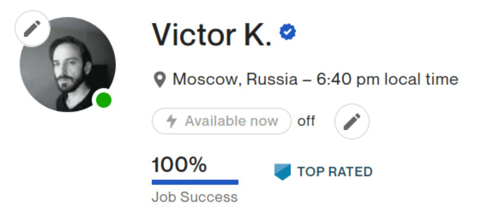
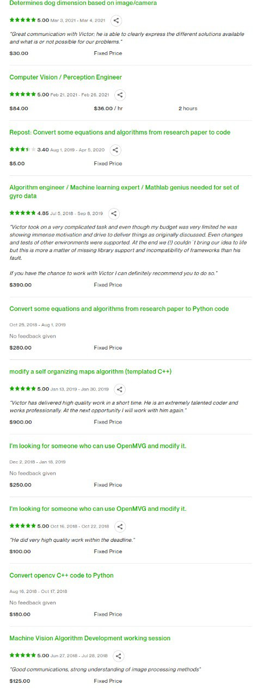
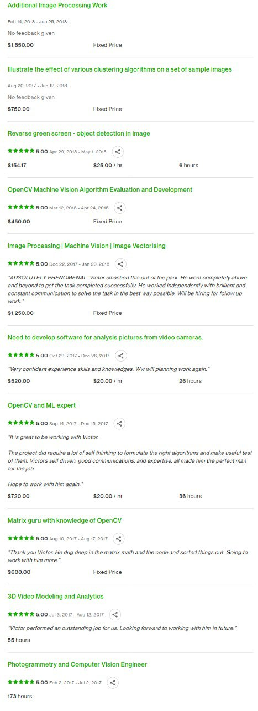
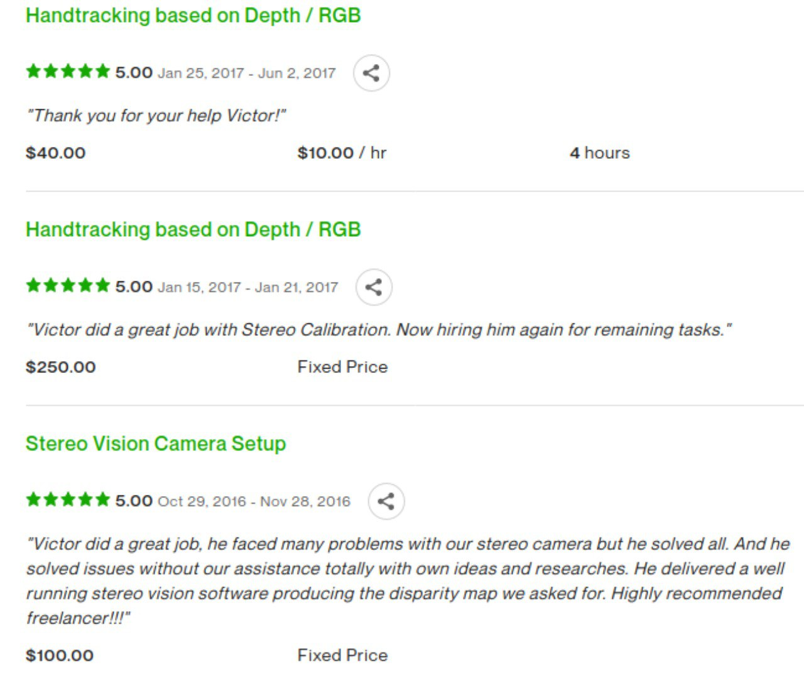

# Victor Kataev

> Computer Vision C++/Python/Matlab Linux Engineer
> 

# ☎️ Contact information

📧 kataev.victor.1234@gmail.com

+995 559 152786

[https://t.me/victor12341234](https://t.me/victor12341234)

🔗 [Github](https://github.com/victor1234)

🔗 [Linkedin](https://www.linkedin.com/in/victor-kataev-77a284ba/)

---

# **👩🏻‍💻** Work experience

## ****C++ Software Engineer****

PANDA GmbH · Remote *– (September 2021 — present)*

- Maintainer and main developer of metric math lib
- Math algorithms optimization
- Created tiny dnn engine from scratch
- Computer vision algorithm develop
- Daubechies wavelets algorithm optimization
- Setup CI, CB, c++ python bindings, pip packaging systems

### Computer vision engineer (OpenCV mainteiner)

*Experience.ai, Remote, March 2022 — May 2022*

- Calibration module
    - Fix, improve and refactor camera model source code
    - Fix and improve several unit tests and benchmarks
    - Implement toolset for synthetic camera model calibration benchmark
- Coordinate and implement Clang-format file to put in order code style in OpenCV

## Computer Vision Engineer

Huawei*, R&D department, Moscow – (December 2019 — September 2021)*

- Precise camera localization by 2D code
- Fast pose recognition of 3D dot pattern
- Researching deeply modern nonlinear solver (GTSAM)
- Create slam backend engine from scratch (project manager)

## Computer Vision Engineer

Freelance*, Moscow – (May 2012 — December 2019)*

Created:

- Stereocamera system with two single cams(calibration, synchronization)
- Application for one hand big gesture recognition with monolense camera
- Sportsmen id identification by self-developed 2d-barcode (with checksum)
- Hockey trainer device (two high-speed cameras detected pucks trajectory, velocity and
hit point)
- UAV landing system (by tracking QR-code and obtain relative position with high
accuracy in bad light and weather conditions)
- Video search engine (search modified (color, crop, reflection) clip in video database)
- worked with drone orthophoto map creation, structures from motion
- My Upwork profile screenshots with clients reviews (tap to expand):
    - Profile
        
        
        
    - Job review
        
        
        
    - Job review
        
        
        
    - Job review
        
        
        
    - Job review
        
        
        

## C++ Developer

Biglion*, Moscow – (March 2012 — May 2012)*

Worked on mobile application for Samsung Bada OS.

## ****Augmented Reality Software Engineer****

Hotspot*, Moscow – (may 2011 — march 2012)*

Created own augment reality engine from scratch.
Worked with kinect (gesture interface)
Created application with face detection, crop, morph and paste to movie
automatically.

---

# 🛠 Skills

**C++** as *main language*

**Python** for *prototyping*

**Matlab** for *algorithms reference implementation and documentation* 

**CMake** as *main framework  for build, test and benchmark project*

**Conan** *for crossplatform dependencies management*

**OpenCV**, **DLib** as *computer vision libs*

**Ceres,** **GTSAM** as *nonlinear solver libs*

**Blaze**, **Eigen** as *linear algebra  libs*

**GNUPlot**, **Matplotlib,** **plotly**, **dash** for *visualization*

**GIT** as *version control system*

**Catch2** as *test framework*

**CLion**, **NeoVim** as *IDE and code editor*

---

# Opensource activity

## Personal

- [Imalig](https://github.com/victor1234/imalig)

## In team

- [WaveletBuffer](https://github.com/panda-official/WaveletBuffer) ( *Math algo optimization, build system: conan, python, CI*)
- [Metric](https://github.com/metric-space-ai/metric) (*linear algebra optimization, dnn engine, etc, build system, CI*)
- [MatrixCompressor](https://github.com/panda-official/MatrixCompressor) (*whole project*)

## As user

- [conan-center-index](https://github.com/conan-io/conan-center-index/pulls?q=is%3Apr+author%3Avictor1234+is%3Aclosed)

---

## 🗣 Languages

### English

****Conversational

### Russian

Native speaker

---

# 📚 Education

## National Research Nuclear University MEPhI (Moscow
Engineering Physics Institute

Master's degree,  Experimental and Theoretical Physics,  Radiation protection and dosimetry (2003-2009)
